# SEI - Project Three - Watchit

## Table of contents

* Project Overview
* The Brief
* Technologies Used
* Approach Taken (featured code)
* Final Product (screenshot walkthrough)
* Wins & Challenges
* Bugs
* Future Content and Improvements
* Key Learnings

## Project Overview
For Project 3 of the General Assembly Software Engineering Immersive course, we had one week to build a full-stack (MERN) application of our choice in a group of three. 

Our idea was “WatchIt”, a movie matching app that would suggest a movie to watch based on two users' preferences. We’ve all been there, trying to decide what to watch with family, friends and loved ones can be a time-consuming task. This aims to solve this problem by suggesting a film that you and your fellow watcher have both “liked” on the app. 

Once a user has created an account, they can swipe through the top 250 IMDb movies, “liking” and “disliking” the movies as they go. When it comes to choosing a film to watch, the user can input the username of the person they are watching with (this user will also need to go through the same process of liking and disliking movies) and the app will suggest a movie to watch that both users have previously “liked”.

**Project Members**:

* Joe Rose: [github.com/joerose117](github.com/joerose117)
* Alex H: [github.com/hal-alex](github.com/hal-alex)
* Milly Arkwright: [github.com/millyarkwright](github.com/millyarkwright)

***

#### You will find the deployed app here: [sei-project3-moviematch.netlify.app](https://sei-project3-moviematch.netlify.app/)

Please note that user authentication is required, anyone interested in the app is welcome to use the following credentials: 

* Username: user1
* Password: user1123

Please choose either user2 or user3 to watch with. 

***

### Code Installation
Clone or download the repos (sei-project3-fe (frontend) and sei-project3-be (backend)) then in your Terminal run the following commands (in both frontend and backend folders):
* Install dependencies `npm i`
* Start the backend server and frontend server: `npm run start`

## The Brief

* Build a full-stack application by making your own back-end and your own front-end
* Use an Express API to serve your data from a Mongo database
* Consume your API with a separate front-end built with React
* Be a complete product which most likely means multiple relationships and CRUD functionality for at least a couple of models
* Implement thoughtful user stories/wireframes that are significant enough to help you know which features are core MVP and which you can cut
* Be deployed online so it's publicly accessible.

## Technologies Used

#### Backend:
* MongoDB
* Mongoose
* Express
* Node.js
* Bcrypt
* jsonwebtoken

#### Frontend:
* JavaScript (ES6)
* React
  * react-router-dom
  * react-bootstrap
* Nodemon
* Axios
* HTML
* SCSS & Bootstrap 

#### Development tools:
* VS Code
* npm
* Insomnia
* Git & Github
* Google Chrome dev tools
* Heroku & Netlify(deployment)
* Trello Board (planning and timeline)
* Excalidraw (wireframing)

## Approach taken (featured code)

After receiving the brief, we started out by brainstorming different ideas on what we wanted to do for our project. After spending some time discussing ideas, we agreed upon a movie based app that would solve the often long debate over what film to watch when with family, friends or housemates. 

We used Git and GitHub for version control; this was our first time creating and working on separate GitHub branches so we thought it best to do our pushes and pull to Github as a group as we’d been warned about the potential horrors of merge conflicts. 

We divided the tasks; Alex took a particular interest in authentication so he started on the login, register and navbar components on the front-end whilst Joe and I paircoded the backend. Once the backend was complete, we moved onto paircode the movieSwipe and movieMatch frontend. Alex and I also paircoded the change password functionality in the profile section and the redirect when users attempted to visit authenticated pages when they weren’t logged in. 

### Planning

Once we settled on our idea, we had to source a database of films which we could use for our own database. Fortunately we quickly found one on GitHub: [IMDb Top 250 Movies](https://github.com/movie-monk-b0t/top250/blob/master/top250_min.json). We used Trello to list out backend and frontend requirements which subsequently acted as our to-do list. This did evolve as the project progressed, for example, the redirect and change password functionalities were added on the penultimate day. 

We then proceeded to wireframe on Excalidraw; we included some features that we knew would be stretch goals such as adding and accepting friends and there were certain elements that we weren’t able to implement when it came down to it such as adding multiple users to match with and presenting the user with multiple films after matching with another user (both of which are in the future improvements section below). 

**Trello**

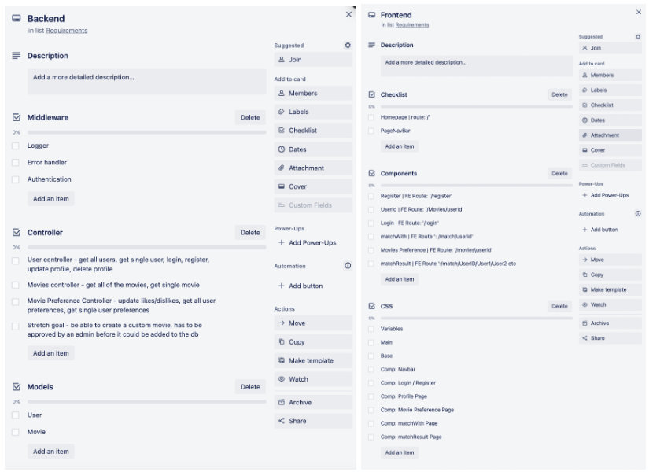

**Excalidraw**

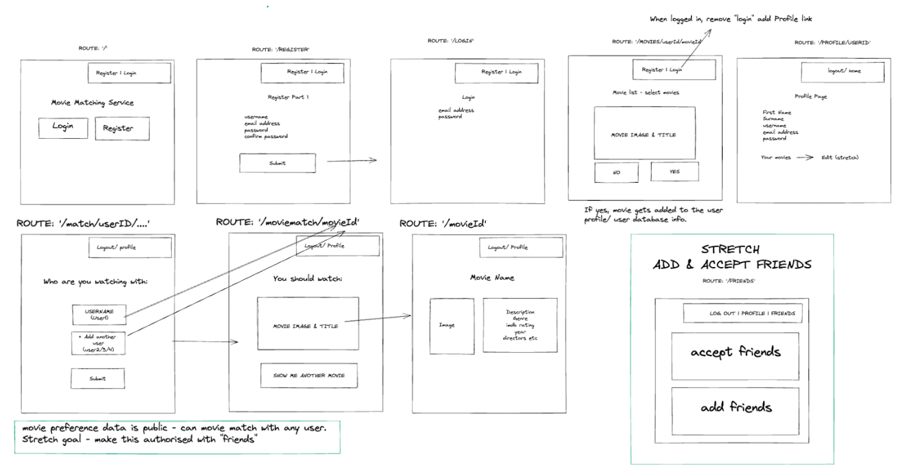

### Key features

Our two key features were “movie swipe” and “movie match”; the former is where the user sets their movie preferences by “swiping” through all the movies in our database, liking and disliking them as they go. The latter is the second step, the user enters the username of the person they are planning to watch a movie with and, once submitted, a random movie that is in both the current user’s and the chosen user’s “liked movies” list will be shown. 

**MovieSwipe**

Our MovieSwipe feature required the full list of movies, a function to filter this list by the movies the user had already swiped, and a way to connect to our backend and send a put request that would update the user’s preferences when they liked or disliked a movie. 

*Full list of movies*

We found a list of the top 250 movies on GitHub which were in JSON format and we seeded this data. This had the benefit of making our app feel full and also meant that users would be given the same options of films to swipe. One concern we had was that, with a large database, users might swipe loads of films and still have no matches with other users. By presenting the films in order it would be more likely that we would be able to provide a match, even if the user had only swiped through a few movies. 

*Filter movies the user had already liked*

In our backend, our User controller meant we pulled the data from the user currently logged in, and provided an error message, if the current user could not be found. Whilst, we had a feature on our front end to prevent this page being accessible unless our user was logged in, we included this error handler in case we had further updates. 

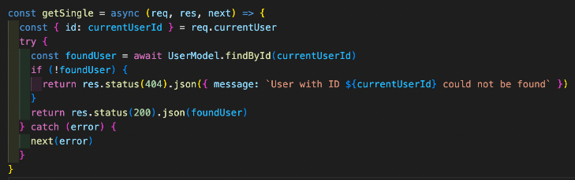

In the frontend, once we had already fetched the user data, we fetched all the movies from our database and then filtered the data using the filter array method. We created two new variables called ‘movieAlreadyLiked’ and ‘movieAlreadyDisliked’ which checked if the ID of the movie from the pulled movies matched any values in the users’ ‘moviesLiked’/ ‘moviesDisliked’ object. If there were no matches it was given a falsey value and the value was only returned if neither ‘movieAlreadyLiked’ or ‘movieAlreadyDisliked’ were truthy. 

We then set the ‘allMovies’ state to ‘filteredData’. This meant the user was presented with an array of films they had not yet been shown and could pick up where they left off each time they logged in. 

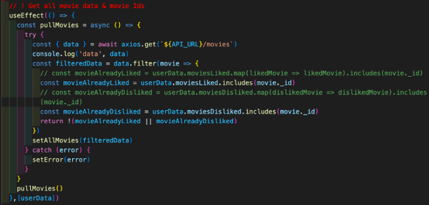

As this was our first time working with a MERN full stack app, and as we had only been taught it a week previous, it was perhaps inevitable that our code would have a few mistakes. In writing this readMe, we have noticed that the map function used in movieAlreadyLiked and Disliked is redundant. This has subsequently been commented out and rewritten without the map function. 

*Updating the user’s preferences*

With allMovies set as our filtered movies array, we know that unless our user has swiped on every movie, they will be presented with the first value in our array. This means that on page load, the user will always be swiping on allMovies[0]. Our function sends a put request, updating our moviesLiked or moviesDisliked list depending on which button the user clicked. 

Once the user has selected like or dislike, our count (which starts at 0) is updated by 1 and the movie at index 1 (allMovies[1]) will be shown. 

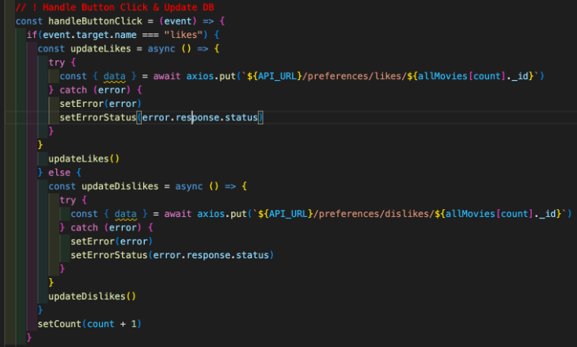

Our backend works by pushing the movieId to our moviesLiked or moviesDisliked field in our User Model:

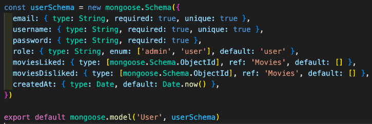

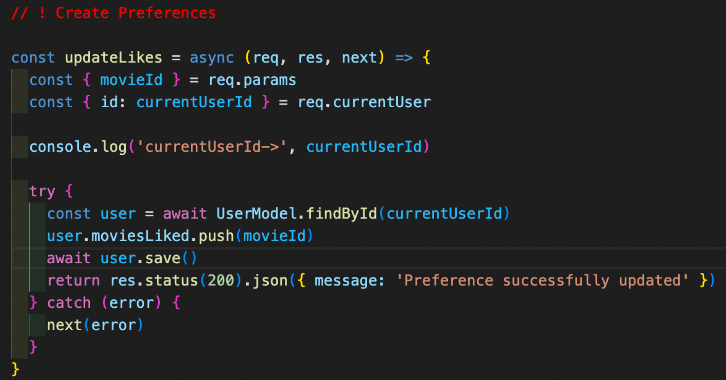

**MovieMatch**

Once the user enters the username of the person they’re watching with and clicks submit, this will call the handleSubmit function. Here, the first port of call is finding the chosen user in the database to check if they exist. This is done by matching the username of the chosen user (this data is saved to the state labelled “watchWith” in the handleChange function). If the user can’t be found, the error message “Please enter a valid username” will be displayed. If the user is found, all the movies liked by our current user and all the movies liked by our chosen (“found”) user are saved to respective variables. These are then used to create an array of movies (ids) that are in both the current user’s and found user’s liked movies list by filtering one list by the movieIds in the other list. 

Using Math.floor & Math.random, a random movieId in the filteredMovies array is then generated and the user taken to that movie’s detail page. If no common movies are found, then an error message will be displayed: “Sadly, you have no films in common…”.

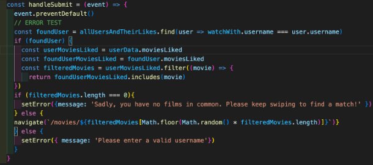

Originally we wanted the user to be able to select multiple users to watch with but we were slightly running out of time so focussed on getting the movieMatch function to work with one user. Additionally, we wanted the user to be able to flick through all the movies they have in common, however, we agreed to stick to generating one random movie and add this feature to our stretch goals/future improvements.

### Additional Featured Code

**Redirect for authorised pages**

We wanted the user to be redirected to the login page if they tried to access a page that requires the user to be logged in to access. If a 401 (UnAuthorised) error was returned when the get request for user data was made, we pulled in the “NeedToLogIn” component which contained a useEffect that would navigate the user to the login page after the page the user had tried to access had loaded.

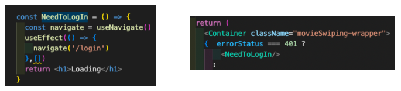

**Change Password**

We added a small feature that allowed users to change their password from their profile page when logged into their account. Whilst it was useful practice, the feature as it currently stands is probably not that useful given most users want to change their password when they can’t remember their current one! I would like to improve this by creating a password reset token that would be used when the user accesses the reset password page, the link for which would be sent to the user by email. 

This was relatively quick to implement as it used some of the same logic and code as the register feature. 

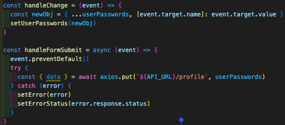

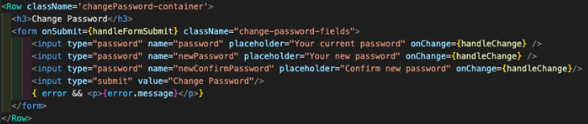

*Backend*

There were a few of checks that needed to be made before updating the password: 
1. Check the user exists 
2. Check if the user has permission to change the password (the user can only update their own password so we check that the username of the current user (taken from the request) matches the username of the user found in the database. The admin is also able to update user passwords). 
3. As another safety measure, the user has to input their original password in order to change it so there is a check in place to ensure these match. We do this by using bcrypt.compare; the password inputted by the user is the first argument which will be encrypted and then compared to the password currently in the database (which is already encrypted). 
4. If this passes, we check the password and confirmPassword (both inputted by the user) match. 
5. If this passes, the new password is encrypted using salt and bcrypt. 
6. The new encrypted password is then saved to the database. 

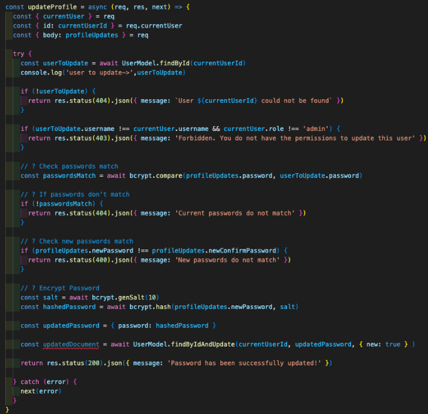

## Final Project (screenshot walkthrough)

**MovieSwipe**
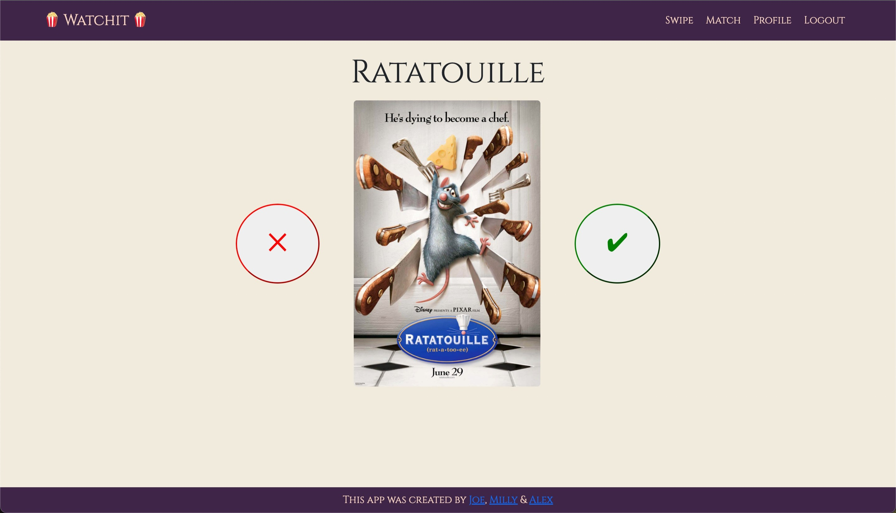

**Movie Detail Page**
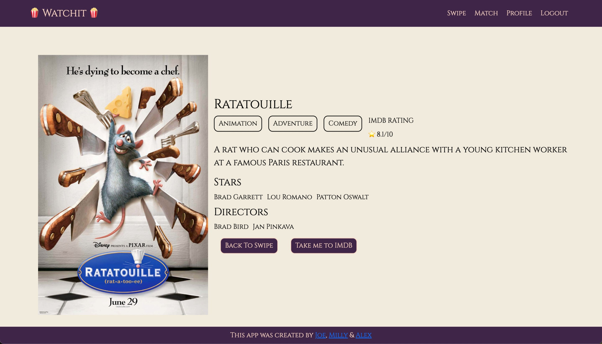

**Match With**
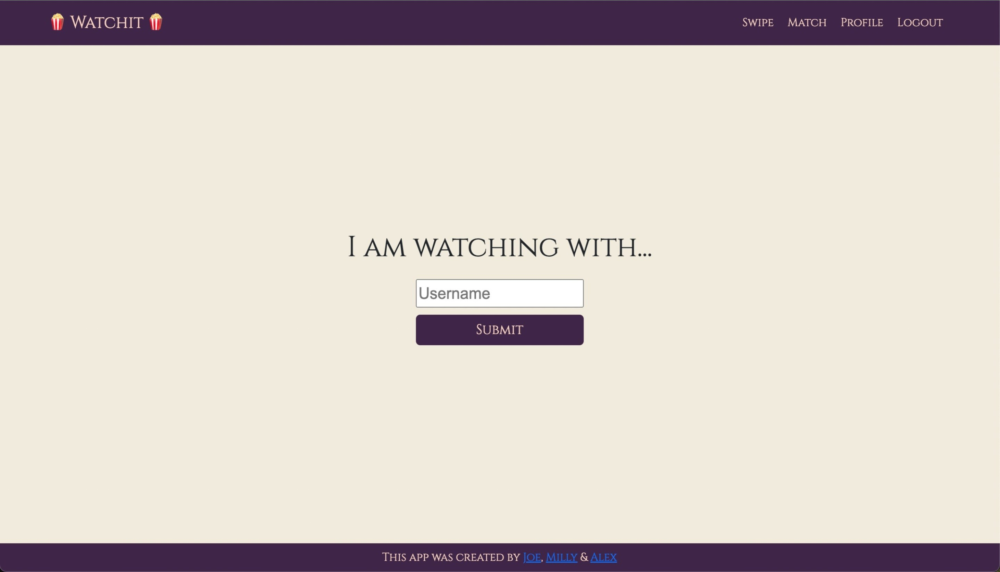

→ Once submitted, the user will then be taken to the movie detail page (see below).

**Matched Movie**
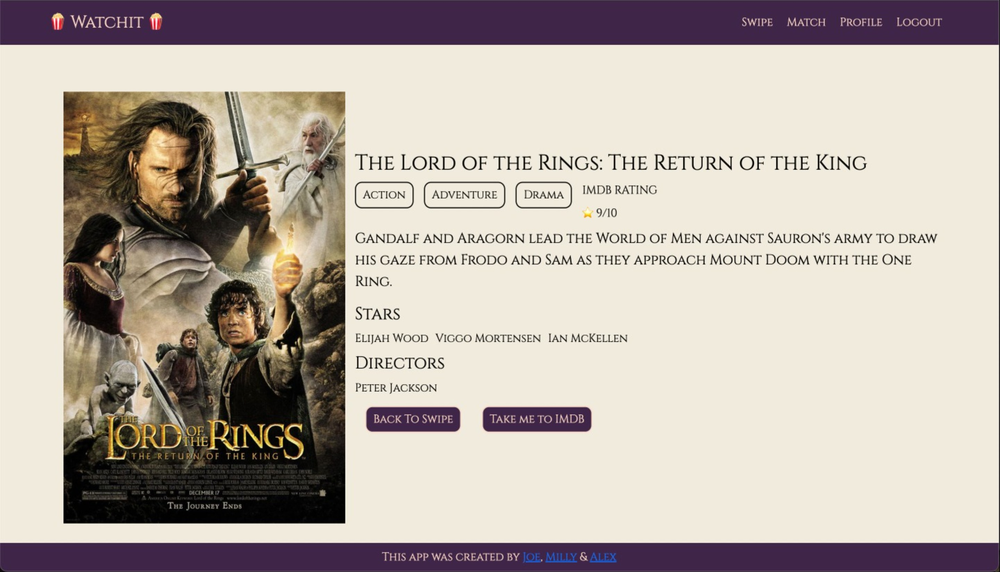

**Profile Page**
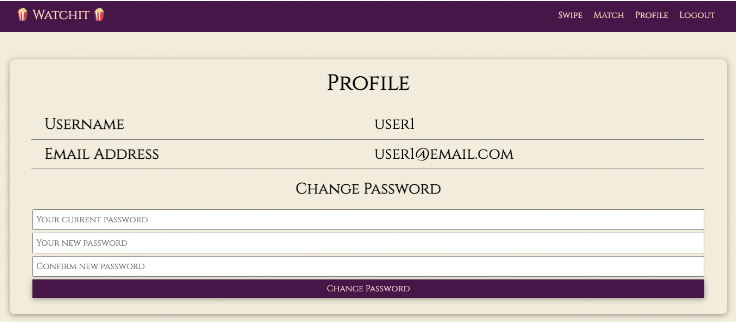

## Wins & Challenges

Communication was both a win and a challenge throughout this project; sharing ideas and problem solving together was more effective and more enjoyable, with team spirits kept high when working on Zoom together. However, maintaining a high level of communication throughout the project was sometimes a challenge when there were outstanding commitments or differing schedules between team members. 

This was our first time working with Git as part of a team so we had a couple of teething issues and it took us a couple of attempts to get used to checking out and merging feature branches. I found good communication was key to avoid any major merge conflicts. 

## Future Content and Improvements

* **Watch with multiple users**
  * Either by adding a dynamic form or React Select (multi). 
* **View all movies in common**
  * After matching with a user, rather than generate a random movie, allow the user to flick through all the movies they have in common. 
* **Add & Accept Friends**
  * Create functionality for adding and accepting friends.
  * Amend the movieMatch function so you can only select to watch with users you’re friends with rather than all users. Include a searchable drop-down of friends to watch with.
* **Edit Movie Preferences**
  * Allow users to edit the movies that are in their likes and disliked lists. 
* **Change Homepage**
  * Change to be an index of the 250 movies in our database with filters for name and genre. 
* **Password reset**
  * Create a password reset token and link to be sent to the user’s email. 
* **Improve styling and responsiveness**

## Key Learnings

* This was definitely the most challenging project of the three we’ve done so far. I definitely felt the difference between working in a pair (Project 2) vs working in a group of 3. It threw the importance of communication into high relief, particularly so when there are different schedules/commitments to balance between team members. 

* We paircoded the majority of this project and whilst I am huge fan of paircoding, I think this project would have benefitted from a better division of responsibilities with team members taking ownership of their respective areas of responsibility. 

* I feel significantly more comfortable using Git and GitHub after this project, there were a few hiccups along the way which was to be expected given it was our first time creating and merging branches but it provided a great learning experience and helped me become more comfortable with Git and resolving merge conflicts. 

* This was my first project working on the backend and I really enjoyed the server-side web application logic and integration as well as learning how to set up different models and create controllers for different requests. It also felt very satisfying creating code that allowed our database and application to communicate with one another. 

